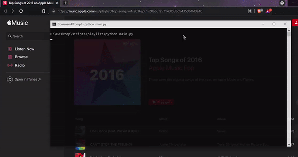
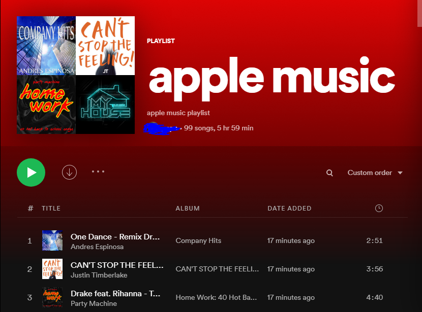

# playlist-converter
Convert Apple Music playlists to Spotify

 

<h2>Setup</h2>

<li>1. Go to the <a href="https://developer.spotify.com/dashboard/applications">Spotify Developer Dashboard</a></li>
<li>2. Press "Create an app" and give a name and description</li>
<li>3. Once created, make a note of the "Client ID" and "Client Secret", put these into the secrets.py file</li>
<li>4. Press edit settings and add a redirect URI, use localhost and a random port, followed by callback at the end e.g. "http://localhost:8888/callback"</li>
<li>5. Finally go into command prompt and set values like so:</li>

set SPOTIPY_CLIENT_ID='your-client-id' 
set SPOTIPY_CLIENT_SECRET='your-client-secret' 
set SPOTIPY_REDIRECT_URI='your-redirect-uri'

<i><b>if you are on MacOS or Linux, use export not set</b></i>

$ pip3 install -r requirements.txt  
$ python main.py

Now you are ready to go!

